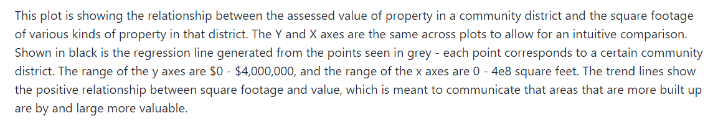

.png)
## Review:

#### CLARITY: 
* It is great that the caption part provides detail description of the figure.
* There are 5 subplots with an overall y axis label, 5 different x axis labels, and 5 linear regression results of the correlation between assessed value of property and square footage of various kinds of property in a community district. Your idea of making Y and X axes the same across plots to allow for an intuitive comparison is great but I think this way of visulization brings the following negative effects.
* The Y axis of each subplot is so short that lots of scatters can not be seen clearly
* The X axes are the same, only showing and comparing different ranges of the square footage of various kinds of property in all districts which is not a very useful information.
* The bottom suplot is too small with scatters and fit line only located on the left corner.
* There should a title briefly introduing the content of this plot.
* I think it is better to make 5 individual plots to show the linear regression results.

#### AETHETIC: 
* The whole plot only has two colors, including black and gray. I think using more colorful colors will attract readers more since there are 5 subplots.

#### HONESTY: 
* The plot shows 5 simple linear regression results and honestly reproduces the data. 
